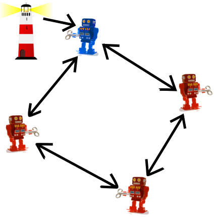
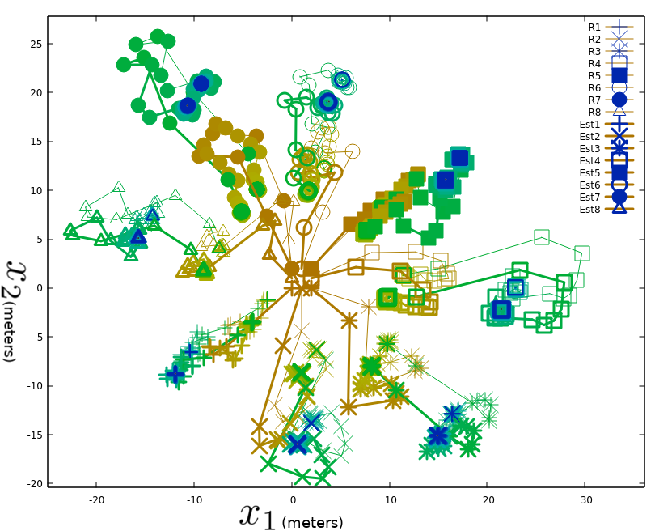
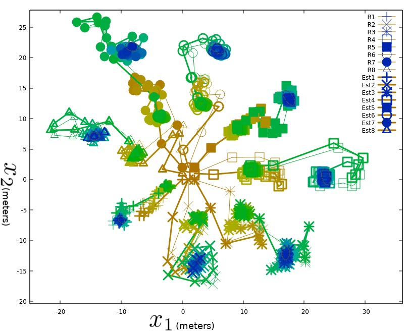
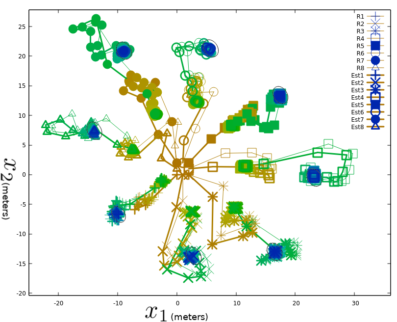

# Two Dimensional Simulation



This is a simulation of decentralized cooperative localization in a two
dimensional space.

Each robot estimates its own location based on interactions with its neighbors.
A pair of robots take an measurement on their relative poses with respect to
each other's location. They also communicate and exchange their estimated
locations. The estimated location is updated based on that information.

This work was published to [Ubiquitous Robots 2020](http://www.ubiquitousrobots.org/2020/index.php). For more details, please
refer to the paper titled "Conservative Data Exchange for Decentralized
Cooperative Localization."
This repository have some updates after the conference.
To see the exact code at the time of presentation at the conference, please checkout
the update tagged `UR2020` by the following command.
```
git checkout UR2020
```

<!--
# Pseudocode

init locations
each step
  each robot
    decide control
    execute the control
    predict the location
  each robot
    take measurement (communication)
    update its location estimate
-->

# Compilation
CMake and gcc/g++ must be installed.
Also gnuplot is required to display the outputs.

In the directory where this file is located,
```
mkdir build
cd build
cmake ..
make
```

# How to Run/Outputs
A simulation is conducted based on the settings provided in `./settings.yaml`.

In the directory where you compiled the source code,
```
./twodimsim
```

It will show simulation results in the terminal. At the end, gnuplot commands
will be printed so the results can be graphically displayed.

For example,
```
gnuplot
plot "output.dat" u 1:2 title "x1", "output.dat" u 1:5 title "x2", "output.dat" u 1:8 title "x3", "output.dat" u 1:3:4 with errorbars title "m1", "output.dat" u 1:6:7 with errorbars title "m2", "output.dat" u 1:9:10 with errorbars title "m3"
```
```
plot "output.dat" u 1:2 title "x1", "output.dat" u 1:5 title "x2", "output.dat" u 1:8 title "x3", "output.dat" u 1:11 title "x4", "output.dat" u 1:14 title "x5", "output.dat" u 1:3:4 with errorbars title "m1", "output.dat" u 1:6:7 with errorbars title "m2", "output.dat" u 1:9:10 with errorbars title "m3", "output.dat" u 1:12:13 with errorbars title "m4", "output.dat" u 1:15:16 with errorbars title "m5"
```

In the terminal, run gnuplot and run the gnuplot commands which was displayed in
the simulation results.

The results will look like the following figures. Thin lines are their actual
trajectories, and thick lines are estimated ones by each method.

Note: the captions for axes in the figures were added manually for explanation
purposes, so the actual outputs will not show the axis caption.

## Naive

## Conservative Intersection-based

## Proposed

